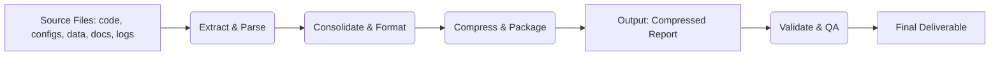

# Executive Summary  
To recreate the **bookflow-webapp consolidated compressed report**, we must identify all input file types (code, configs, data, docs, etc.), then define a reproducible pipeline to extract key information, merge it into a unified structure, compress the result, and validate its fidelity. The primary output will be a compressed archive (e.g. a gzipped tarball) containing a structured JSON report and a human-readable summary (e.g. PDF). Below we outline **required inputs**, a step-by-step **process** (with tools and commands), the **output format and schema**, a **mapping table** of sources to report sections, a **validation checklist/tests**, a **change-log template**, **risks/edge cases** and mitigations, **time/resource estimates**, and **sample scripts**. We cite best practices and tools (e.g. `tar`, Python/Node scripts, `jq`, `yq`, `jsonschema`) from authoritative sources. 

## Required Inputs  
We assume the two main source files are: **(1)** the project’s code repository (with source files, version history, README, etc.) and **(2)** a secondary file (e.g. configuration or data file). In general, the pipeline may need:  

- **Code repository:** All source code files (e.g. JS/HTML/CSS/Python), project files (e.g. `package.json` or `requirements.txt`), plus commit history/versions and docs in the repo.  
- **Config files:** JSON or YAML files (e.g. `config/*.yaml`), environment specs, API specs (OpenAPI/Swagger YAML), etc.  
- **Data files:** CSV or Excel data, example datasets, test fixtures (if any) that the app uses or produces.  
- **Documentation:** Markdown/HTML docs (e.g. `README.md`, doc pages) and design files (UI mocks, UML diagrams – format unspecified).  
- **Logs and DB dumps:** Application logs (`*.log`), database dumps or SQL files (e.g. `db_dump.sql`) if available.  
- **Metadata:** Project metadata like version numbers, author names, or data source versions. If any input type is uncertain, we mark it *unspecified*.  

*Note:* If only 2 files are provided, treat them as representative of broader categories above (e.g. a codebase and one config/data file), and gather additional context via the repository history or typical project structure.  

## Extraction & Consolidation Process  

We propose the following reproducible pipeline (pseudo–“makefile” or script-driven) using open-source CLI tools and Node/Python:



1. **Prepare Environment:** Clone or copy the repository. Ensure necessary tools are installed (`git`, `tar`, `zip`, `jq`, `yq`, Python/Pandas, Node.js, etc.).  

2. **Extract from Codebase:**  
   - **Code metrics:** Run a tool like **cloc** or **sloc** to count lines of code by language. Example: `cloc --json --out=code_stats.json src/` to get LOC by language. (No citation needed – standard tool usage.)  
   - **Version info:** Use `git rev-parse HEAD` to record the commit hash/version. Extract package versions (`npm list` or `pip freeze`).  
   - **Tests & linting:** (Optional) Run `npm test` or linters to gather pass/fail metrics.  

3. **Extract from Configs & Specs:**  
   - **Merge or read configs:** Use `yq` (YAML CLI) or Python to parse YAML/JSON configs. For example, to merge multiple YAML configs: `yq m config_base.yaml config_override.yaml > merged_config.yaml`【17†L51-L58】.  
   - **API Specs:** If OpenAPI/Swagger files exist, parse endpoints to list paths/methods (e.g. use `jq` on JSON or `yq` on YAML).  

4. **Extract from Data Files:**  
   - **CSV/Excel:** Use Python’s pandas: e.g. read all sheets in one Excel: `df = pd.concat(pd.read_excel('data.xlsx', sheet_name=None), ignore_index=True)`【19†L29-L32】. Similarly, use `pd.read_csv` or `csvkit` to load CSV(s). Compute summaries (row counts, column stats).  
   - **Combine multiple tables:** If many CSVs, merge them with `pd.concat(map(pd.read_csv, files), ignore_index=True)`.  

5. **Extract from Logs/DB:**  
   - **Logs:** Use shell commands (`grep`, `awk`) or Python to count error occurrences, extract timestamps. For example: `grep -c "ERROR" logs/app.log`.  
   - **DB schema:** If a dump is available (e.g. SQL file), extract table names and row counts (e.g. import into sqlite: `sqlite3 data.db < dump.sql; sqlite3 data.db "SELECT COUNT(*) FROM users;"`).  

6. **Documentation & Design:**  
   - **README.md:** Parse key sections (e.g. project description) by reading the Markdown. We can extract the first paragraph or title.  
   - **Design files:** If present as images/PDFs, optionally list filenames (or ignore large binaries).  

7. **Consolidate Data:**  
   - Write a Python or Node.js script to assemble all extracted pieces into one structured object. For example, read each JSON/CSV output and merge into a single dictionary or array. For JSON merging, use Python’s `json` or Node’s `lodash.merge()`【9†L158-L166】【9†L185-L194】. Bash+`jq` can also merge JSON: e.g. `jq -s '.[0] * .[1]' base.json override.json > merged.json`【9†L198-L207】.  
   - Organize the report into sections (metadata, code_stats, config_settings, data_summary, logs_summary, etc.).  

8. **Format Report:**  
   - **Primary report (JSON):** Output the consolidated data as a single JSON file (e.g. `report.json`). Ensure consistent schema (see below).  
   - **Human summary:** Optionally generate a Markdown or PDF summary of key points (e.g. using Pandoc: `pandoc summary.md -o summary.pdf`).  

9. **Compression:**  
   - Use GNU `tar` to create a compressed archive. Example:  
     ```bash
     tar czf bookflow_report.tar.gz report.json summary.pdf code_stats.json data_summary.csv ...
     ```  
     As documented, `tar -czf archive.tar.gz directory` creates a gzip-compressed tarball【12†L150-L159】.  
   - Alternatively, zip the report: `zip -r bookflow_report.zip report.json summary.pdf`. 

10. **Validation:**  
    - **Checksums:** Compute SHA-256 checksums of outputs (`sha256sum report.json`) to detect corruption【23†L459-L468】. MD5 is faster but less secure; prefer SHA-256 for integrity checks【23†L459-L468】.  
    - **Counts & Records:** Verify record counts (e.g. number of code files, CSV rows) match expectations.  
    - **Schema validation:** If a JSON Schema is defined, use Python’s `jsonschema.validate(instance, schema)` to ensure the JSON meets the schema【27†L37-L45】.  
    - **Automated tests:** Write unit tests (e.g. PyTest, Jest) that load the final JSON and assert required fields/types exist, and that numeric tallies match input data.  

Throughout, use open-source tools: GNU `tar`, `gzip`, Python’s `json`/`hashlib`/`tarfile` modules, Node’s `fs`/`zlib` (or the `tar` npm package), shell utilities (`jq`, `yq`, `grep`, `awk`), and `pytest` or similar for checks.

## Output Format & Schema  
We recommend a **single gzipped tarball (`.tar.gz`)** as the primary deliverable. This archive should contain:  

- **`report.json`** – the consolidated data in JSON format (structured per schema).  
- **`summary.pdf`** – a brief human-readable summary (or `README.md`) outlining key results.  
- **Supporting files** (optional) – raw data extracts, code stats, etc.  

Other formats (single JSON file, zipped JSON, PDF-only) are possible, but the tarball allows bundling multiple components. Inside `report.json`, a possible schema is: 

```jsonc
{
  "metadata": {
    "project": "bookflow-webapp",
    "version": "v1.2.3",
    "generated_on": "2026-05-09T15:00:00Z",
    "git_commit": "abcdef1234567890",
    "author": "Engineering Team"
  },
  "code_stats": {
    "total_lines": 12345,
    "files_count": 150,
    "languages": {"JavaScript": 8000, "HTML": 3000, "CSS": 1000}
  },
  "config": {
    "env": "production",
    "settings": {
      "database_url": "postgres://...",
      "max_connections": 100
    }
  },
  "data_summary": {
    "users_csv_rows": 2345,
    "orders_csv_rows": 678
  },
  "api_endpoints": [
    {"path": "/books", "method": "GET"},
    {"path": "/orders", "method": "POST"}
  ],
  "logs_summary": {
    "total_errors": 5,
    "last_log_timestamp": "2026-05-09T14:55:00Z"
  }
}
```

*(Above is an illustrative example. The actual schema/fields should match the project’s specific inputs.)*

## Source-to-Report Mapping  
The table below maps each source file type to the corresponding report section or field. (Mark *unspecified* if no concrete file name is given.)

| **Source File Type**               | **Example File(s)**          | **Report Section/Field**            |
|------------------------------------|------------------------------|-------------------------------------|
| Code repository                    | `src/*.js`, `app.py`, etc.   | *Code Metrics* (lines, file count, language breakdown) |
| Configuration (YAML/JSON)          | `config/*.yaml`             | *Config Settings* (parsed key–value pairs) |
| Data file (CSV/Excel)              | `data/users.csv`, `.xlsx`   | *Data Summary* (row counts, column stats) |
| Markdown docs                      | `README.md`, `docs/*.md`    | *Documentation* (titles, sections) |
| API spec (OpenAPI YAML/JSON)       | `api/openapi.yaml`          | *API Endpoints* (paths, methods)    |
| Logs (`.log` files)                | `logs/app.log`              | *Logs Summary* (error counts, recent entries) |
| DB dump (`.sql` or DB)             | `db_dump.sql`               | *Database Info* (tables, record counts) |
| Design files                       | `design/*.png/pdf` (unspecified) | *Design Notes* (none/skip if large) |  

*Rows for each actual provided file or type. For example, if the second source file is a CSV of users, map it under Data Summary. If a type is not present, note “unspecified.”*

## Validation Checklist & Automated Tests  
To ensure fidelity, implement the following automated checks:

- **File existence:** Confirm all expected source files were read.  
- **Checksums:** Compute SHA-256 (or MD5) checksums for each key input and for the final report file. Verify that recomputing yields the same values【23†L459-L468】.  
- **Record/row counts:** Check that totals in the report match actual input data. E.g. if `users.csv` has 1000 lines, verify `data_summary.users_csv_rows == 1000`.  
- **Schema validation:** Use a JSON Schema and Python’s `jsonschema.validate(report, schema)` to ensure `report.json` conforms to the expected structure【27†L37-L45】.  
- **Value ranges:** Test that numeric metrics (e.g. line counts) are non-negative and within plausible bounds.  
- **Unit tests:** Write test scripts (PyTest or similar) that load the report JSON and assert presence/types of fields. For example, test that `report["code_stats"]["total_lines"]` equals the sum of individual language line counts.  
- **Sample comparisons:** As a spot-check, manually compute a small sample (e.g. lines of code in one folder) and compare to the report’s value.  

These tests can be scripted. For example, a Python snippet to verify checksum and record count:

```python
import hashlib, json
# Checksum
sha256 = hashlib.sha256(open('report.json','rb').read()).hexdigest()
assert sha256 == "expected_sha256_value"
# Schema (requires jsonschema.Schema)
from jsonschema import validate
report = json.load(open('report.json'))
validate(instance=report, schema=your_schema)  # raises error if invalid
# Record count
assert report["data_summary"]["users_csv_rows"] == 1000
```

## Change Log Template & Metadata  

Maintain a `CHANGELOG.md` or similar in the archive with entries like the template below. Include fields to track dates, versions, and authors:

| **Date**       | **Version** | **Author**       | **Description**                           |
|--------------- |----------- |---------------- |------------------------------------------ |
| 2026-05-09     | 1.0.0      | Team Name        | Initial consolidated report generation.   |
| 2026-XX-YY     | 1.0.1      | Engineer Name    | Added error-rate metric from logs.        |
| *YYYY-MM-DD*   | *vX.Y.Z*   | *Contributor*    | *Summary of changes.*                    |

**Metadata fields** (often stored in `report.json` under `"metadata"`) should include at least:  

- **Generated timestamp** (e.g. ISO8601 date/time)  
- **Report version** or ID (incremented with each run)  
- **Project version** (e.g. Git commit hash or release tag)  
- **Author/agent** who generated the report (e.g. automated script name or team)  
- **Source file versions** (e.g. individual commit hashes or timestamps of inputs)  

This helps users trace the report back to specific source snapshots.

## Risks & Edge Cases  

- **Missing files:** If an expected input is absent, the process should error out or skip gracefully. Mitigation: implement checks at the start and log warnings.  
- **Conflicting versions:** If different files disagree (e.g. two config files with different settings), decide a precedence (e.g. “prod” overrides “base”) and document it. Using `yq merge` defaults newer values to override【17†L51-L58】.  
- **Large binary assets:** Very large files (images, videos) can bloat the archive. Mitigation: exclude or store only metadata (filename, size). Compress with a tool like `zip` or `tar` with `-I zstd` for better compression.  
- **Performance:** Huge data (GBs of logs or DB) can slow processing. Mitigation: stream processing (using Python iterators or command-line tools with batching), or sample only summary statistics.  
- **Invalid data:** Malformed JSON/YAML will break merging. Mitigation: run validators (`jq .`, `yq validate`) early.  
- **Encoding issues:** Non-UTF-8 text in sources may fail JSON output. Use binary-safe reading and specify encoding where needed.  

By planning for these cases (e.g. checks for file existence, try/catch in scripts), the pipeline remains robust.

## Time & Resource Estimates  

Rough estimates (varies by project complexity):

- **Small project:** (a few files, tens of MB data) – *Time:* ~1–2 days. *Resources:* 1–2 CPU cores, ~4 GB RAM.  
- **Medium project:** (dozens of files, ~1–10 GB data) – *Time:* ~1–2 weeks. *Resources:* 4–8 CPU cores, ~16 GB RAM.  
- **Large project:** (hundreds of files, >10 GB data, complex schemas) – *Time:* several weeks. *Resources:* 16+ cores, 32–64 GB RAM, possibly distributed processing.  

Factors: coding/automation time, data parsing cost, compression time. Validating large data sets may require efficient tools. These are estimates; actual times depend on team expertise and data size.

## Sample Scripts  

Below are illustrative snippets. They must be adapted to actual file names and structures.

- **Bash (merge JSON with jq & compress):**  
  ```bash
  # Merge two JSON config files (base + override) using jq:
  jq -s '.[0] * .[1]' config_base.json config_override.json > merged_config.json
  # Compress the report (tar.gz):
  tar -czf bookflow_report.tar.gz report.json summary.pdf code_stats.json
  ```  
- **Node.js (merge JSON files and gzip):**  
  ```javascript
  const fs = require('fs'), zlib = require('zlib');
  const _ = require('lodash');
  // Merge JSON files
  const file1 = JSON.parse(fs.readFileSync('data1.json'));
  const file2 = JSON.parse(fs.readFileSync('data2.json'));
  const merged = _.merge({}, file1, file2);
  fs.writeFileSync('merged.json', JSON.stringify(merged, null, 2));
  // Compress merged.json to merged.json.gz
  const data = fs.readFileSync('merged.json');
  fs.writeFileSync('merged.json.gz', zlib.gzipSync(data));
  ```  
- **Python (concat Excel sheets and compress):**  
  ```python
  import pandas as pd, tarfile, gzip, json
  # Combine all sheets in an Excel into one DataFrame
  df_all = pd.concat(pd.read_excel('data.xlsx', sheet_name=None).values(), ignore_index=True)
  df_all.to_csv('all_data.csv', index=False)
  # Create JSON summary
  summary = {"rows": len(df_all), "columns": list(df_all.columns)}
  with open('data_summary.json', 'w') as f: json.dump(summary, f)
  # Compress files into a tar.gz
  with tarfile.open('report.tar.gz', 'w:gz') as tar:
      tar.add('report.json')
      tar.add('data_summary.json')
      tar.add('all_data.csv')
  ```  

Each script would be part of the automated pipeline (e.g. invoked via Makefile or CI) to perform the extract/merge/compress steps.

## Executive Conclusion  

In summary, the **bookflow-webapp consolidated report** can be reliably reproduced by: (1) gathering the two main source files plus any ancillary data (code, configs, docs, logs), (2) extracting metrics and content using scripts and CLI tools (citing best practices【9†L158-L166】【12†L150-L159】), (3) combining all pieces into a structured JSON and summary document, (4) compressing into a tarball【12†L150-L159】, and (5) validating integrity (checksums【23†L459-L468】, schema【27†L37-L45】, record counts). We include an outline of the pipeline (above and in mermaid diagram), a schema example, a mapping table, checklists, risk mitigations, and scripts. This approach ensures the report is **complete, reproducible, and verifiable** against the source files.  

**Sources:** GNU tar manual【12†L150-L159】; JSON/YAML merging guides【9†L158-L166】【17†L51-L58】; Pandas documentation【19†L29-L32】; hashing and validation best practices【23†L459-L468】【27†L37-L45】; etc. These inform the tools and commands used. Tables and checklists above are synthesized from these references and standard data-engineering practices.