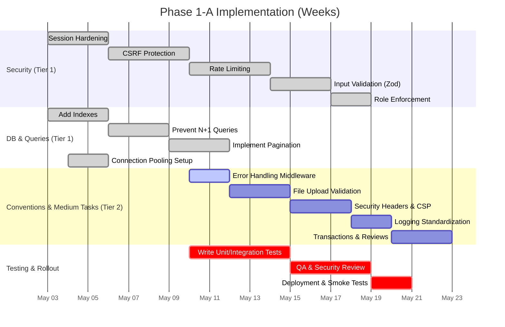

# Phase 1-A Security & DB Optimization Plan

**Executive Summary:** Phase 1‑A focuses on essential security hardening and database performance for BookFlow’s Next.js/Prisma stack. We recommend **no Phase 2 tech** (e.g. no Redis or external caches) and emphasize drop‑in, low‑complexity solutions. Key tasks include securing session cookies, adding CSRF protection, implementing in‑memory rate limiting, strict input validation (e.g. with Zod), enforcing role checks, sanitizing file uploads, and consistent error handling/logging.  On the database side, we’ll add indexes on frequently queried columns, implement proper pagination and batching (to avoid N+1 queries【24†L231-L240】), use Prisma transactions where needed, and ensure a single global Prisma client for connection pooling【24†L205-L213】. Each task below is accompanied by rationale, implementation steps, code snippets (TypeScript/Prisma/SQL), estimated effort, priority (Tier 1 = high, Tier 2 = medium), and risks. A comparative table highlights alternative approaches for CSRF, rate limiting, and validation. We conclude with conventions (naming, middleware, error/log formats), a rollout timeline (Mermaid Gantt), rollback criteria, and suggested tests with examples. All recommendations are grounded in official docs (Next.js, iron-session, Prisma, PostgreSQL, OWASP, etc.)【9†L464-L470】【24†L231-L240】. 

## Security Measures (Phase 1-A)

### Session Hardening (Tier 1)  
**Rationale:** Protect session cookies from theft. Use **secure**, **HttpOnly**, and **SameSite** flags. Rotate TTLs and invalidate after logout【9†L464-L470】【35†L239-L247】.  
- **Steps:** In your `session.ts` config, ensure `cookieOptions: { httpOnly: true, secure: NODE_ENV==='production', sameSite: 'lax', maxAge: ... }`. Set a strong session password via env var. Rotate session on login, destroy on logout (calling `session.destroy()`). Optionally implement session TTL and consider re-sealing data on sensitive actions. For extra safety, add an “isBlocked” flag in the DB to invalidate sessions (per iron-session FAQ【9†L535-L544】).  
- **Code:** Example iron-session config:  
  ```ts
  // lib/session.ts
  import { IronSessionOptions } from 'iron-session';
  export const sessionOptions: IronSessionOptions = {
    password: process.env.SESSION_SECRET!,       // 32+ char key in .env
    cookieName: 'bookflow_session',
    cookieOptions: {
      httpOnly: true,                           // JS cannot access cookie
      secure: process.env.NODE_ENV === 'production', // HTTPS only in prod
      sameSite: 'lax',                          // mitigates CSRF for non-POST
      maxAge: 14 * 24 * 60 * 60,                // 14 days (default)
      path: '/',
    },
    ttl: 14 * 24 * 60 * 60,                     // session TTL 14d
  };
  ```  
- **Effort:** ~2h. **Priority:** Tier 1. **Risks:** Must disable `secure` flag in local dev (HTTPS issue). Session secrets must be 32+ bytes (see Next.js auth guide【5†L870-L879】). Logging out must `session.destroy()` before response.  

### CSRF Protection (Tier 1)  
**Rationale:** Prevent cross-site requests from unauthorized sites. By default, iron-session uses SameSite=Lax cookies, which blocks many CSRF cases【3†L1050-L1054】【52†L27-L34】. However, forms or POSTs may still be vulnerable. OWASP recommends synchronizer tokens or a double-submit-cookie pattern【52†L27-L34】. We should at least check the `Origin`/`Referer` headers on sensitive state‑changing endpoints【53†L13-L16】 and use a CSRF token for forms.  
- **Options:**  
  | Approach                    | Pros                                         | Cons                                      |
  |-----------------------------|----------------------------------------------|-------------------------------------------|
  | **SameSite Cookies Only**    | Built-in; no extra code; blocks many CSRF by default (Lax)【50†L300-L302】 | Does *not* stop CSRF on GET state changes; vulnerable if subdomains or old browsers【51†L81-L89】. |
  | **Double-Submit Cookie**    | No server state needed; token tied to session; OWASP-recommended (signed HMAC)【52†L27-L34】. | Requires generating a CSRF token cookie and injecting it into forms/headers; more code. Naive version is vulnerable to XSS or subdomain attacks【52†L37-L45】. |
  | **Synchronizer Token (Hidden Field)** | Standard solution; token stored server- or session-side. | Must maintain token per session; more implementation work. |
  | **Origin/Referer Check**    | Simple: verify `req.headers.origin` equals your domain【53†L13-L16】. Good defense-in-depth. | Bypassed if attacker uses same site or via scripts; not standalone solution. |
- **Steps:** We recommend **enforcing a CSRF token** (e.g. using [`next-csrf`](https://github.com/vercel/next.js/discussions/13234) or custom) for any POST/PUT forms, plus verifying `Origin` matches your host【53†L13-L16】. For quick start, enable the built-in `SameSite: 'lax'` on cookies and add middleware on API routes:  
  ```ts
  // lib/csrf.ts (using csurf-like logic)
  import { NextApiRequest, NextApiResponse } from 'next';
  export function csrfCheck(handler) {
    return async (req: NextApiRequest, res: NextApiResponse) => {
      const origin = req.headers.origin || req.headers.referer;
      if (origin && !origin.startsWith(process.env.ORIGIN)) {
        return res.status(403).json({ error: 'Invalid origin' });
      }
      // Optionally: verify a token from header vs cookie (double-submit)
      const csrfToken = req.headers['x-csrf-token'];
      const cookieToken = req.cookies['csrf-token'];
      if (!csrfToken || csrfToken !== cookieToken) {
        return res.status(403).json({ error: 'CSRF token mismatch' });
      }
      return handler(req, res);
    };
  }
  ```  
  Use this wrapper on protected routes. Also include a `<input type="hidden">` or custom header with the CSRF token. See OWASP for full patterns【52†L27-L34】.  
- **Effort:** ~3h. **Priority:** Tier 1. **Risks:** Overhead of token management; if mis-implemented (naive double-submit) it can be bypassed【52†L37-L45】. Failing to handle exceptions may break AJAX clients. 

### Rate Limiting (Tier 1)  
**Rationale:** Throttle abuse (brute force, DoS). Even simple in-memory limiters (per IP or user) block excessive attempts【3†L1050-L1054】.  
- **Approaches:**  
  | Strategy           | Memory Use          | Accuracy/Complexity                           |
  |--------------------|---------------------|-----------------------------------------------|
  | **Fixed Window**   | Low (counts per window) | Easy; spikes possible at window edges (over-limit bursts)【26†L120-L129】.  |
  | **Sliding Window** | Medium (timestamps cache) | More accurate; more memory (stores timestamps)【26†L132-L140】. |
  | **Token Bucket**   | Low (counter + time) | Allows burst handling; simple to implement (e.g. refilling tokens)【26†L152-L160】. |
  | **Library (express-rate-limit)** | Depends on store | Provides fixed-window by default; easy use (we can use its MemoryStore). |
- **Steps:** For Phase 1, use a fixed-window limiter per IP (easy to code or via `express-rate-limit`). Example:  
  ```ts
  // lib/rateLimit.ts
  import rateLimit from 'express-rate-limit';
  export const apiLimiter = rateLimit({
    windowMs: 15 * 60 * 1000, // 15 min
    max: 60,                  // 60 req per window per IP
    standardHeaders: true,    // return rate limit info in headers
    legacyHeaders: false,
    handler: (req, res) => {
      res.status(429).json({ error: 'Too many requests, slow down.' });
    },
  });
  ```  
  Then in `pages/api/*` handlers or a custom middleware:  
  ```ts
  import { apiLimiter } from '@/lib/rateLimit';
  export default async function handler(req, res) {
    await new Promise((r, j) => apiLimiter(req, res, (err) => err ? j(err) : r(null)));
    // ... actual logic ...
  }
  ```  
- **Effort:** ~3h. **Priority:** Tier 1. **Risks:** In-memory store is per-instance: if scaled to multiple instances, abuse might circumvent limits (Phase 2 will add Redis or shared store). High limits may still allow brute force; adjust based on load. Clearing old entries is needed to free memory (the library does this).

### Input Validation (Tier 1)  
**Rationale:** All user inputs (API params, form data) must be validated to prevent injection or malformed data. Schema-based validation ensures type/format correctness. In a TypeScript project, **Zod** is a strong choice (TypeScript‑first, good TS support)【19†L610-L614】. Other options (Yup, AJV, Joi) exist, but Zod’s developer experience and performance make it ideal for API payloads.  
- **Comparison:**  
  | Library | TypeScript Support | Size/Dependencies | Use Case                       |
  |---------|--------------------|-------------------|--------------------------------|
  | **Zod** | Excellent (inferred types)【19†L610-L614】 | Zero dependencies, small. | API/server payloads (TS-first) |
  | **Yup** | Good, via typings | Larger; more functions. | Complex form validation (has round/truncate)【19†L601-L609】 |
  | **AJV** | TS via schemas (JSON Schema) | Performance optimized | JSON-schema validation, dynamic rules |
  | **Joi** | Good (old schema lib) | Large, legacy code | Node-only (no browser support)  |
- **Steps:** Choose Zod. For each API route, define a schema and use `safeParse` on `req.body`. Return 400 on failure. For example:  
  ```ts
  // pages/api/users/create.ts
  import { z } from 'zod';
  const createUserSchema = z.object({
    name: z.string().min(1),
    email: z.string().email(),
    password: z.string().min(8),
  });
  export default async function handler(req, res) {
    const result = createUserSchema.safeParse(req.body);
    if (!result.success) {
      return res.status(400).json({ error: result.error.errors });
    }
    const data = result.data;
    // Proceed with data (hashed password, etc.)
  }
  ```  
- **Effort:** ~2h per major route. **Priority:** Tier 1. **Risks:** Validation schemas must be kept in sync with Prisma models. Overly strict validation may break existing clients. Be careful to **not trust client input anywhere** (validate IDs, params as well).

### Role Enforcement (Tier 1)  
**Rationale:** Ensure only users with the proper role (Admin, Employee, Client) can access certain endpoints or pages. Skip if already covered, but double-check ALL sensitive routes.  
- **Steps:** Create a middleware/wrapper (e.g. `withAuth`) that reads the session (`req.session.user`) and checks `user.role`. For Next.js API routes:  
  ```ts
  // lib/withAuth.ts
  import { sessionOptions } from './session';
  export function withAuth(handler: any, allowedRoles: string[]) {
    return async (req, res) => {
      const session = await getIronSession(req, res, sessionOptions);
      if (!session.user || !allowedRoles.includes(session.user.role)) {
        return res.status(403).json({ error: 'Forbidden' });
      }
      return handler(req, res);
    };
  }
  ```  
  Apply as: `export default withAuth(async (req,res) => { ... }, ['admin','employee']);`. For Next.js pages (SSR), use `getServerSideProps` with `withIronSessionSsr` to check session and redirect if unauthorized.  
- **Code:** Example use:  
  ```ts
  import { withAuth } from '@/lib/withAuth';
  async function handler(req, res) {
    // logic here, only reached if user is Admin or Employee
    res.status(200).json({ message: 'OK' });
  }
  export default withAuth(handler, ['admin','employee']);
  ```  
- **Effort:** ~2h. **Priority:** Tier 1. **Risks:** Mistakes in role lists could lock out legitimate users or expose admin APIs. Always *recheck authorization in the data layer* too (e.g. query only those records the user owns).

### File Upload Safety (Tier 2)  
**Rationale:** Prevent malicious file uploads (e.g. PHP images, malware). OWASP advises whitelisting file types, checking content, and limiting size【32†L190-L199】.  
- **Steps:** Use a robust parser (e.g. `formidable` or `multer`). Configure strict filters: only allow needed extensions (e.g. `.jpg`, `.png`, `.pdf`), validate MIME type after upload, and set a max file size (e.g. 2-5 MB). Rename files to a generated safe name; store outside `public/` so they aren’t directly executable. For example:  
  ```ts
  // pages/api/upload.ts
  import formidable from 'formidable';
  export const config = { api: { bodyParser: false } };
  export default async function handler(req, res) {
    const form = formidable({ 
      maxFileSize: 5 * 1024 * 1024, // 5MB
      filter: ({ originalFilename, mimetype }) => {
        // Allow only images/pdf
        return /\.(jpg|jpeg|png|pdf)$/.test(originalFilename || '') 
               && ['image/jpeg','image/png','application/pdf'].includes(mimetype || '');
      }
    });
    form.parse(req, (err, fields, files) => {
      if (err) return res.status(400).json({ error: 'File upload error' });
      // Save file: rename safely, remove path
      // e.g. fs.rename(files.file.path, safePath)
      res.status(200).json({ success: true });
    });
  }
  ```  
- **Effort:** ~4h. **Priority:** Tier 2 (if uploads exist in Phase 1). **Risks:** Rejecting legitimate files (ensure UX). Large files could exhaust memory/CPU; scan files if security concerns exist. Use antivirus or sandbox in Phase 2 if needed. Always run upload handling in separate process/thread to prevent blocking.  

### Error Handling (Tier 2)  
**Rationale:** Do not leak stack traces or internal errors to clients. OWASP recommends a global error handler that returns generic messages and logs full details server-side【35†L239-L247】. Use standard JSON error format (RFC 7807 “Problem Details” is optional but preferred).  
- **Steps:** In all API routes, catch exceptions and return `{ error: '...message...' }` with appropriate status. Create a helper, e.g.:  
  ```ts
  function sendError(res, status, message) {
    console.error(message); // or use logger
    return res.status(status).json({ error: message });
  }
  ```  
  Use `try/catch` in async functions or Next.js `middleware` for errors. Ensure 404/401/403 statuses for client errors, 500 for server errors with minimal info. Log full stack in server logs, not to the client.  
- **Effort:** ~3h. **Priority:** Tier 2. **Risks:** Too generic messages may frustrate debugging. Ensure logging is enough to diagnose issues (see Logging section). Uncaught exceptions could crash the server; use `process.on('unhandledRejection', ...)` to catch any gaps.  

### Security Headers (Tier 2)  
**Rationale:** HTTP headers can mitigate clickjacking, MIME sniffing, XSS, etc. OWASP recommends at least `X-Frame-Options: DENY` and `X-Content-Type-Options: nosniff`【50†L300-L302】【50†L334-L338】. Other useful headers: `Content-Security-Policy`, `Strict-Transport-Security` (HSTS), `Referrer-Policy`, `Permissions-Policy`, remove `X-Powered-By`/`Server`.  
- **Steps:** In `next.config.js`, use the `headers` function:  
  ```js
  module.exports = {
    async headers() {
      return [
        {
          source: '/:path*',
          headers: [
            { key: 'X-Frame-Options', value: 'DENY' },             // no framing【50†L300-L302】
            { key: 'X-Content-Type-Options', value: 'nosniff' },   // no MIME sniffing【50†L334-L338】
            { key: 'Referrer-Policy', value: 'strict-origin-when-cross-origin' },
            { key: 'Permissions-Policy', value: 'geolocation=(), microphone=()' },
            { key: 'X-Robots-Tag', value: 'noindex' },
            { key: 'X-Powered-By', value: ' ' },                   // remove tech stack info【47†L597-L605】
            { key: 'Strict-Transport-Security', value: 'max-age=63072000; includeSubDomains; preload' },
            // Optionally: Content-Security-Policy header here (complex to configure)
          ],
        },
      ];
    },
  };
  ```  
- **Effort:** ~2h. **Priority:** Tier 2. **Risks:** CSP/HSTS must be correct: HSTS with wrong cert can lock users out (per OWASP【50†L421-L430】). CSP can break fonts/scripts if too strict. Test all routes after adding.  

### Logging and Privacy (Tier 2)  
**Rationale:** Audit trails are critical, but avoid logging sensitive data. Follow OWASP’s logging guidance: log events (logins, admin actions, errors) in a structured JSON format, but **never log credentials or unneeded PII**. IP addresses can be PII under GDPR and should be anonymized or handled with care【43†L411-L419】. Define retention (e.g. 90 days) and purge logs containing personal data.  
- **Steps:** Standardize log format (timestamp, level, userID, action, outcome). Use a logging library (e.g. Winston/Pino) configured to output JSON. In every route/middleware, log key events (e.g. `logger.info('User login success', { userId, sourceIp })`). For privacy, strip out fields: e.g. do not log user passwords, and consider hashing IP (or omit full IP). OWASP advises marking IP as PII requiring compliance【43†L411-L419】. Implement log rotation (e.g. daily log files) and a process to delete logs older than N days.  
- **Effort:** ~3h. **Priority:** Tier 2. **Risks:** Over-logging can expose PII (username, email, IP)【43†L411-L419】 and fill storage. Under-logging hinders audits. Ensure logs are stored securely (no public read) and monitor for anomalies.  

## Database Conventions & Optimizations (Phase 1-A)

### Indexing Strategy (Tier 1)  
**Rationale:** PostgreSQL indexes drastically speed up lookups on large tables by avoiding full scans【22†L57-L60】. Prisma best practices echo this: **index fields used in `WHERE`, `ORDER BY`, and relations**【24†L148-L156】. For example, add indexes on foreign keys (`userId`), email (for login), and any filtered fields (e.g. appointment date, status).  
- **Steps:** Review slow queries (e.g. from logs or Prisma Debug). In `schema.prisma`, add `@@index` on needed columns. E.g.:  
  ```prisma
  model Appointment {
    id        Int      @id @default(autoincrement())
    clientId  Int
    date      DateTime
    status    String
    client    User     @relation(fields: [clientId], references: [id])
    @@index([clientId])
    @@index([date])
    @@index([status])
  }
  ```  
  Run `prisma migrate dev` to create indexes in DB. Avoid unnecessary indexes (each index slows writes). Monitor `EXPLAIN` plans if performance issues persist.  
- **Effort:** ~2h. **Priority:** Tier 1. **Risks:** Too many indexes increase disk usage and slow INSERT/UPDATE. Partial or composite indexes can optimize further but add complexity; consider in Phase 2 if needed.  

### Preventing N+1 Queries (Tier 1)  
**Rationale:** N+1 occurs when fetching a list and then querying details for each item separately, causing many round-trips【24†L231-L240】. Prisma recommends using `include` or batching via `IN`.  
- **Steps:** Rewrite queries that do nested loops into single queries. For example, instead of:  
  ```ts
  const users = await prisma.user.findMany();
  for (let u of users) {
    const posts = await prisma.post.findMany({ where: { authorId: u.id } });
  }
  ```  
  do either:  
  ```ts
  const usersWithPosts = await prisma.user.findMany({
    include: { posts: true }
  });
  ```  
  or batch:  
  ```ts
  const users = await prisma.user.findMany();
  const posts = await prisma.post.findMany({
    where: { authorId: { in: users.map(u => u.id) } }
  });
  ```  
- **Effort:** ~3h. **Priority:** Tier 1. **Risks:** Including relations can pull large objects (increase payload). Use `select` to limit fields if needed. For very large relations, prefer batching rather than including everything.  

### Pagination and Aggregation (Tier 1)  
**Rationale:** Avoid loading huge result sets. Use pagination (skip/take) or cursor pagination【24†L291-L300】. Use database aggregation (COUNT, SUM) instead of client‑side loops.  
- **Steps:** For endpoints returning lists (e.g. users, appointments), accept `page`/`limit` or cursor params. Implement offset pagination for small tables:  
  ```ts
  const page = Number(req.query.page) || 1;
  const perPage = 20;
  const items = await prisma.appointment.findMany({
    skip: (page-1)*perPage,
    take: perPage,
    orderBy: { date: 'desc' },
  });
  ```  
  For larger sets, use cursor:  
  ```ts
  const { cursorId } = req.query;
  const items = await prisma.appointment.findMany({
    take: 20,
    cursor: cursorId ? { id: Number(cursorId) } : undefined,
    skip: cursorId ? 1 : 0,
    orderBy: { id: 'asc' },
  });
  ```  
  For totals, use `count`: `await prisma.appointment.count({ where: {...} })`. Prefer SQL aggregations (e.g. `AVG`, `COUNT`) over fetching records and computing in JS.  
- **Effort:** ~3h. **Priority:** Tier 1. **Risks:** Offset pagination degrades on large pages; plan cursor for big tables. Remember to sort consistently.  

### Transactions (Tier 2)  
**Rationale:** Ensure atomic updates (e.g. create user + audit log). Prisma supports transactions via `prisma.$transaction`.  
- **Steps:** Identify multi-step writes (e.g. booking creation + notification). Wrap in a transaction:  
  ```ts
  const [appointment, log] = await prisma.$transaction([
    prisma.appointment.create({ data: { ... } }),
    prisma.auditLog.create({ data: { action: 'create_appointment', userId } })
  ]);
  ```  
- **Effort:** ~2h. **Priority:** Tier 2. **Risks:** Transactions can lock rows; avoid long-held transactions.  

### Bloom Filter Handling (Tier 2)  
**Rationale:** BookFlow uses an in-memory Bloom filter for appointment ID lookups (per Phase 1 report). Ensure it’s populated at startup (e.g. load existing IDs) and updated on new deletions/creates. Keep false-positive rate acceptable.  
- **Steps:** On server start, query all appointment IDs into a Bloom filter structure (e.g. [`bloom-filters`](https://www.npmjs.com/package/bloom-filters)). Update it on create/delete. Monitor memory usage and clear if full.  
- **Effort:** ~1h. **Priority:** Tier 2. **Risks:** Bloom filters can give false positives (benign here). If the filter capacity is exceeded, performance may degrade; consider resetting periodically.  

### Connection Pooling (Tier 1)  
**Rationale:** One Prisma client = one connection pool. Multiple instantiations (e.g. on each function) exhaust connections【24†L205-L213】.  
- **Steps:** Create a single `PrismaClient` and reuse it. In Next.js, instantiate outside of handler (in a shared module). Example:  
  ```ts
  // lib/prisma.ts
  import { PrismaClient } from '@prisma/client';
  const prisma = new PrismaClient();
  export default prisma;
  ```  
  Then import this `prisma` everywhere. For serverless envs, use a global as recommended by Prisma docs.  
- **Effort:** ~1h. **Priority:** Tier 1. **Risks:** Rarely, long‑lived pools can hold idle connections; ensure your pool size fits DB limits.  

## Conventions & Standards

- **Naming:** Use consistent naming (camelCase for JS, `snake_case` or Pascal for DB fields). Prefix private cookies with `__Host-` (prevents cross-domain subcookie access). Environment variables UPPERCASE (e.g. `SESSION_SECRET`).  
- **Middleware Placement:** Put global middleware (auth, rate-limit, CSRF) in a central `lib/middleware.ts` or apply in `pages/_middleware.ts` (pages router) or wrap API handlers as above. Keep middleware logic DRY.  
- **Error Format:** Return errors as `{ error: string, details?: any }`. For consistency, we recommend following [RFC 7807 Problem Details][1] in Phase 2, but for now a simple JSON with `error` and `statusCode` is fine. Log error stacks server-side only.  
- **Logging:** Log in JSON. Include at least `{ timestamp, level, event, userId?, sourceIp? }`. Apply OWASP’s logging vocabulary【43†L411-L419】: treat IP as PII (mask or delete it on anonymization). Store logs in secure storage (append-only files or a log management system) with retention policy (e.g. auto-delete after 90 days).  
- **Privacy:** **Do not log** sensitive info: passwords, full credit card data, etc. Audit logs (e.g. login attempts) should record only what’s needed for security (IP or userId is OK but consider hashing or anonymizing)【43†L411-L419】.  
- **Checklist & Style:** Follow Next.js and Prisma style (use `async/await`, no unused promises). Place helper middleware near top of API routes. Use `ts-node-dev` for formatting. Document assumptions in code comments if any.

## Rollout Plan

A phased rollout ensures stability. We suggest implementing **Tier 1** items first (security-critical, high-priority), then Tier 2. Below is a Gantt chart (Mermaid) outlining approximate timing over ~3–4 weeks (adjust per team size). Milestones include code reviews, QA passes, and deployment tests.



**Milestones & Acceptance Criteria:**  
- *Session Hardening Complete:* All cookies have `Secure`/`HttpOnly`/`SameSite`; dev env still works with `Secure=false`. Manual test: able to login/out, cookies set correctly (use browser dev tools).  
- *CSRF Protection:* A form or API requiring POST will reject cross-origin requests (test with spoofed origin or missing token). CSRF token included in forms and validated on POST.  
- *Rate Limiting:* After N requests (e.g. 60) within window, API returns 429. Verify with a script hitting endpoints repeatedly.  
- *Input Validation:* Invalid payloads get `400 Bad Request` with error message. Write unit tests for each schema.  
- *Role Enforcement:* Attempt as unauthorized user → 403. Confirm admin routes cannot be accessed by non-admins.  
- *Database Checks:* Key endpoints with large tables remain performant (no full scans). Indexes in place (check via `EXPLAIN`). N+1 cases replaced by single queries.  
- *Headers:* Inspect HTTP responses; headers like `X-Frame-Options: DENY`, `X-Content-Type-Options: nosniff` appear globally. Verify HSTS header and absence of `X-Powered-By`.  
- *Error Handling:* Provoking an exception (e.g. invalid query) returns a JSON `{ error: "..."}` without stack trace.  
- *Logging:* Execute actions (login, create), check logs: contain `{userId, event, ipMask}` in JSON. No raw password or tokens.  
- *Automated Tests:* All new unit/integration tests pass, especially security cases (e.g. invalid input is rejected).  

**Rollback Criteria:** If a change causes failures (e.g. broken auth or data corruption), revert that component: disable the feature (e.g. comment out middleware), restore DB via backups. Since Phase 1-A changes are additive/configuration, rollback means removing the config and code and re-testing. Always backup the database before migrations (prisma automatically creates backups). Monitor logs and metrics (login failures, 500 rates) post-deploy; if spikes occur, roll back the last release.

## Testing Plan

**Unit Tests:** Validate each piece of logic in isolation (e.g. Zod schemas, utility functions). Example with Jest:  
```ts
import { createUserSchema } from '@/lib/validation';
test('createUserSchema rejects short password', () => {
  const result = createUserSchema.safeParse({name:'A',email:'x@y.com',password:'123'});
  expect(result.success).toBe(false);
  expect(result.error?.errors[0].message).toMatch(/at least 8/i);
});
```

**Integration Tests:** Use [Supertest](https://github.com/visionmedia/supertest) or similar to test API routes end-to-end. For example:  
```ts
import request from 'supertest';
import app from '@/pages/api/_app'; // Next.js handler
test('unauthenticated user cannot access /api/admin', async () => {
  const res = await request(app).get('/api/admin');
  expect(res.status).toBe(403);
});
test('rate limiter blocks excess requests', async () => {
  for(let i=0; i<60; i++) {
    await request(app).get('/api/some-protected');
  }
  const res = await request(app).get('/api/some-protected');
  expect(res.status).toBe(429);
});
```

**Security Tests:** Simulate attacks. E.g. try submitting a cross-site POST (missing CSRF token) and expect 403. Attempt file upload with disallowed extension (like `image.php`) and ensure 400. Check that SQL injections or invalid IDs are rejected by our validation (parameterize any raw queries).

**Manual Acceptance:** Check UIs respect role redirects, forms include CSRF hidden fields, and cookies have the correct flags. Use browser dev tools or curl for manual checks.

## Sources

- Next.js Security/Data Guides【3†L1050-L1054】【5†L870-L879】  
- iron-session README (cookie defaults)【9†L464-L470】  
- Prisma Best Practices (indexes, N+1, pooling)【24†L148-L156】【24†L231-L240】【24†L205-L213】  
- PostgreSQL Indexes docs【22†L57-L60】  
- OWASP CSRF Cheat Sheet【52†L27-L34】【53†L13-L16】  
- OWASP HTTP Headers Cheat Sheet【50†L300-L302】【50†L334-L338】  
- OWASP File Upload Cheat Sheet【32†L190-L199】  
- OWASP Error Handling【35†L239-L247】  
- OWASP Logging Vocabulary【43†L411-L419】  
- Zod vs Yup (LogRocket)【19†L610-L614】  

Each recommendation above is based on official or authoritative guidance. This plan is intended to be actionable with small code snippets that can be dropped into the existing codebase, with clear development effort and priorities indicated. Adjust timelines and effort estimates as needed based on team size and actual scope.  

