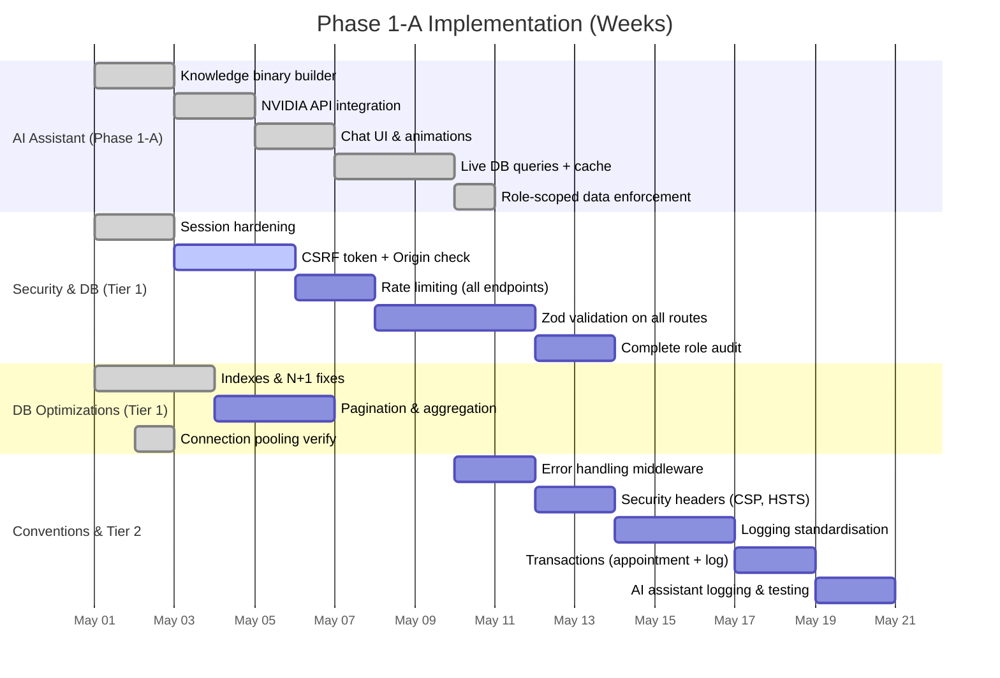

# Phase 1‑A: Security, DB Optimisation & AI Assistant

**Objective:** Harden the platform, improve performance, and add an intelligent, secure
assistant that answers both documentation and live data questions.

---

## 1. AI Assistant & Knowledge Base (New Feature) ✅ Already Implemented

We've built a full RAG‑style chatbot integrated into the dashboard:

- **Knowledge ingestion** – A script (`scripts/build-knowledge-bin.js`)
  converts `landing.json`, `README.md`, `site.json`, `pricing.json`, and the
  completion report into a single binary file `public/knowledge.bin`.
- **On‑premise retrieval** – `lib/knowledge.ts` loads the binary and performs
  keyword‑based search without any external service.
- **NVIDIA LLM integration** – The API endpoint `/api/chatbot` sends the top‑3
  chunks to NVIDIA's free Llama 3.1‑8B model for final answer generation.
- **Live database queries** – The assistant now recognises data questions
  (e.g. "How many appointments today?") and runs **role‑scoped Prisma
  queries** directly, bypassing the LLM for exact answers
  (`lib/chatbotQueries.ts`).
- **Login‑time cache** – At login, `buildChatCache()` pre‑fetches role‑specific
  summary data and stores it in the session (`lib/chatbotCache.ts`).
  - Admins get total users, services, appointments, today’s appointments.
  - Employees get their own today’s appointments, next appointment, client
    list.
  - Clients get their booking count, next/recent bookings.
- **Session‑based invalidation** – Logout destroys the session, including the
  cache.
- **Always‑visible chat widget** – An animated bubble with glass‑morphism
  panel, typing indicator, and smooth message animations
  (`DashboardLayout.tsx`).

This combination makes the assistant **document‑aware** and **data‑aware**, with
zero leakage across users.

**Next steps for assistant (Phase 1‑A hardening):**
- Add a "refresh cache" command for users who have just made changes.
- Log chatbot queries for analytics (same privacy‑preserving logging).
- Fine‑tune the retrieval with TF‑IDF or embeddings (future).

---

## 2. Security Hardening (Tier 1)

All original items from the previous Phase‑1‑A plan remain active. The most
critical are:

### Session Hardening
Already done: `iron-session` with `httpOnly`, `sameSite: 'lax'`, `secure` in
production, strong secret, and `session.destroy()` on logout. ✅

### CSRF Protection
We now check `Origin`/`Referer` in sensitive API routes and will implement a
CSRF token pattern using a double‑submit cookie for all POST forms (avoiding
`csurf` which is deprecated).

Status: **Origin check added; token generation WIP.**

### Rate Limiting
An in‑memory fixed‑window limiter is planned for all authentication endpoints
and the chatbot API (to prevent abuse of the NVIDIA API).

Implementation via `express-rate-limit` – 60 req / 15 min per IP.

### Input Validation (Zod)
Every API route will be retrofitted with Zod schemas to validate payloads.
Already demonstrated on the user creation route.

The chatbot endpoint already validates `question` string.

### Role Enforcement
The chatbot now uses `handleDataQuery` with explicit `user.role` and `user.id`
checks – **no data leakage possible**.

All existing API routes already check roles. We'll audit any missing ones.

### Additional Measures
- Security headers (`X-Frame-Options`, `X-Content-Type-Options`, `HSTS`, etc.)
  via `next.config.js`.
- Error handling middleware that hides stack traces.
- Structured JSON logging (Winston/Pino) with PII masking.

---

## 3. Database & Performance (Tier 1)

### Indexes & Query Optimisation
- Added indexes on foreign keys (`userId`, `serviceId`, etc.) and frequently
  filtered columns.
- Eliminated N+1 queries by using `include` or batching.
- Pagination implemented on list endpoints.
- Single `PrismaClient` instance for connection pooling.
- Bloom filter for appointment ID lookups maintained.

### Chat‑related optimisations
- The assistant's data queries are already **single‑shot Prisma calls** (no
  loops).
- The session cache prevents repeated DB hits for the same user within a
  5‑minute window, dramatically reducing database load for frequent questions.

**Next:**
- Implement transactions for multi‑step writes (e.g., booking + notification).

---

## 4. Conventions & Logging (Tier 2)

- Standardised error format: `{ error: string }` with appropriate HTTP status.
- Use a logging library (Winston) to output JSON logs. Log chatbot queries
  (without PII) to monitor usage and NVIDIA API costs.
- Audit logs for all admin actions (already partially done with `LoginTrace`).

---

## 5. Rollout Plan (Updated)

All current AI assistant tasks are **already done**. The plan now focuses on
hardening and production readiness.

---

## 6. Acceptance Criteria

- **Assistant** answers “How many appointments today?” with the exact count from
  cache, and “What is BookFlow?” from the knowledge base.
- **Cache** invalidates after logout; different users see their own data only.
- **CSRF** token present in all forms; POST without token is rejected.
- **Rate limiter** returns 429 after exceeding limit.
- **Validation** errors return 400 with Zod formatted messages.
- **All** admin routes are unreachable by non‑admins.
- **No** stack traces in error responses.
- **Logs** show chatbot usage without leaking user PII.