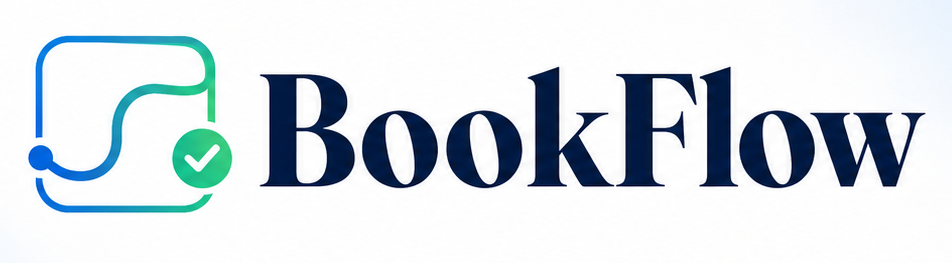

[](https://app.netlify.com/projects/bookfly-app/deploys)

# Booking & Workflow SaaS

**A full‑stack booking platform showcasing stabilisation, modernisation, and system‑design maturity.**

Built to simulate a **Timely / Fresha‑likegi** appointment scheduling SaaS with role‑based dashboards, background job processing, a polished UI, and an evolving design system.

> **Primary goal:** Prove the ability to rescue, upgrade, and extend legacy systems while demonstrating forward‑thinking architectural decisions.

---

## 📚 Central Documentation Index

This README is the **master reference** for the project. All detailed specifications and research notes are maintained in separate files, listed below.

| Document / File                | Purpose                                                                 |
| ------------------------------ | ----------------------------------------------------------------------- |
| **DESIGN.md**                  | Design system tokens, layout, components, colour palette, typography    |
| **PRICING_RESEARCH.md**       | Research on SaaS pricing tier strategies and CTA best practices         |
| **DATABASE_OPTIMIZATION.md** | Strategic plan for Bloom‑filter‑based database query optimisation       |
| **pricing.json**               | Configuration for the pricing page (plans, features, FAQ)               |
| **landing.json**               | All text labels for the public landing page                             |
| **site.json**                  | Complete UI label catalogue for the admin/employee/client dashboards    |
| **prisma/schema.prisma**       | Database schema (User, Service, BookedAppointment, SmsLog, etc.)        |

---

## 🚀 Live Demo (Local)

```bash
git clone <repo-url>
cd stabilisation-demo
pnpm install
docker run --name stabilisation-db -e POSTGRES_PASSWORD=postgres -e POSTGRES_DB=stabilisation -p 5432:5432 -d postgres:15
pnpm prisma migrate deploy && pnpm prisma db seed
pnpm dev
```

Visit `http://localhost:3000`

---

## ✨ Features

- 🔐 **Session‑based authentication** – role‑specific dashboards (Admin, Employee, Client)
- 🧑‍💼 **Admin command centre** – real‑time KPI cards, overdue alerts, weekly chart, user/appointment management with inline forms and modals
- 👩‍🔧 **Employee panel** – daily appointments, SMS overview, create bookings, view details in a modal
- 🧑‍🦱 **Client panel** – service discovery, one‑click booking, booking history with date‑fns formatting
- 📱 **SMS retry background job** – demonstrates retry logic with exponential backoff
- 💲 **Tiered pricing page** – Solo / Studio / Business / Enterprise with “Most Popular” highlight, annual toggle, FAQ, and plan‑change API
- 🎨 **Unified Glass‑morphism & SAP Fiori UI** – consistent design tokens, responsive layout, mobile‑ready sidebar drawer
- 🗃️ **PostgreSQL + Prisma ORM** – migrations, seeding, and typed database access
- ⚙️ **CI/CD skeleton** (GitHub Actions) – ready for Vercel / Netlify deployment

---

## 🛠️ Tech Stack

| Layer             | Technology                                               |
| ----------------- | -------------------------------------------------------- |
| Frontend          | Next.js 14 (Pages Router), React, TypeScript             |
| Backend           | Next.js API routes                                        |
| AI / NLP          | NVIDIA Llama 3.1‑8B (free tier), RAG retrieval            |
| Knowledge Base    | Custom binary index (`knowledge.bin`), in‑memory TF‑IDF search |
| Database          | PostgreSQL 15 (Docker)                                    |
| ORM               | Prisma 5                                                 |
| Authentication    | iron‑session v7                                          |
| Styling           | CSS Modules + global CSS                                 |
| Package Manager   | pnpm                                                     |
| Background Jobs   | Netlify Functions (serverless) / Node.js + ts‑node        |
| Caching           | In‑memory session‑based cache (chatbotCache.ts)           |
| CI/CD             | GitHub Actions                                           |

---

## 📁 Project Structure

```
stabilisation-demo/
├── components/
│   ├── DashboardLayout.tsx          # Main layout (sidebar, topbar, mobile drawer, chat widget)
│   └── DashboardLayout_v1.1.tsx     # Updated variant with chat UI (if still present)
├── lib/
│   ├── db.ts                        # Prisma client singleton
│   ├── session.ts                   # iron‑session configuration
│   ├── withAuth.ts                  # Auth wrappers for API and SSR
│   ├── formatDate.ts                # Shared date‑formatting utility
│   ├── notifications.tsx            # Global notification context
│   ├── bloom.ts                     # In‑memory Bloom filter (email + appointment ID)
│   ├── planLimits.ts                # Subscription plan limit enforcement
│   ├── knowledge.ts                 # Binary knowledge loader & search
│   ├── chatbotQueries.ts            # Intent‑based live DB query handler
│   ├── chatbotCache.ts              # Login‑time per‑role cache builder
│   └── rateLimit.ts                 # (if created) API rate limiter
├── pages/
│   ├── _app.tsx                     # Global CSS, Font Awesome, providers
│   ├── _document.tsx                # Shared HTML structure (Font Awesome CDN, favicon)
│   ├── index.tsx                    # Public landing page (from landing.json)
│   ├── login.tsx / register.tsx     # Auth pages (with titles, loading spinners)
│   ├── pricing.tsx                  # Pricing page (from pricing.json)
│   ├── api/
│   │   ├── auth/
│   │   │   ├── login.ts             # (updated) builds chat cache on success
│   │   │   ├── logout.ts            # destroys session + cache
│   │   │   └── register.ts          # (updated) builds cache on signup
│   │   ├── chatbot.ts               # NVIDIA‑powered assistant endpoint
│   │   └── ...                      # other existing API routes
│   ├── admin/                       # Admin dashboard, users, services, appointments
│   ├── employee/                    # Employee dashboard, appointments, create
│   └── client/                      # Client dashboard, book, my‑bookings
├── prisma/
│   ├── schema.prisma                # Database schema (User, Service, Booking, etc.)
│   ├── seed.ts                      # Seed data (users, services, 12 appointments)
│   └── migrations/                  # Applied migrations (includes LoginTrace)
├── scripts/
│   └── build-knowledge-bin.js       # Builds binary knowledge base from docs
├── netlify/
│   ├── netlify.toml                 # Netlify serverless functions config
│   └── functions/                   # Background worker as scheduled function
├── public/
│   ├── knowledge.bin                # Compiled binary knowledge for the assistant
│   ├── favicon.ico                  # Local favicon
│   └── ...                          # other static assets (logos, images)
├── src/                             # Worker scripts (Prisma‑import fixed)
│   └── background-jobs/             # (if still used for local dev)
├── styles/globals.css               # Global CSS (SAP Fiori, login styles)
├── landing.json                     # Landing page labels & data
├── pricing.json                     # Pricing page plans & FAQ
├── site.json                        # Admin/Employee/Client UI labels
├── chat.json                        # Chatbot widget labels & system prompt
├── Dockerfile                       # App container definition
├── docker-compose.yml               # PostgreSQL + app services
├── .github/workflows/               # CI/CD pipeline (GitHub Actions)
├── DESIGN.md                        # Design system tokens, layout, components
├── PRICING_RESEARCH.md              # Pricing tier CTA research & best practices
├── DATABASE_OPTIMIZATION.md         # Bloom‑filter optimisation plan
├── Phase-1-Completion-Report–BookFlow.md  # Phase 1 summary & commit log
├── Phase-1-A-Security-and-DB-Optimization-Plan.md  # Security/DB hardening roadmap
└── Phase-1-A-b-Report.md            # Phase 1‑A‑b report (AI assistant + infra)
```

---

## 🎨 Design System Overview

The UI is built around a **two‑column fixed + fluid layout** with a glass‑morphism topbar and a navy sidebar. All colours, spacing, and typography are governed by CSS custom properties declared in `:root` (see `DESIGN.md` for full tables).

**Key Tokens**

| Token             | Value   |
| ----------------- | ------- |
| `--sidebar-w`     | 220px   |
| `--topbar-h`      | 64px    |
| `--bg‑sidebar`    | #001e4a |
| `--sap‑primary`   | #0a6ed1 |
| `--accent‑green`  | #22c55e |
| `--radius‑card`   | 16px    |
| `--radius‑btn`    | 10px    |

**Components**

- **Card** – white background, subtle border, 16px rounding
- **Table** – wrapped in `.table‑wrapper` with horizontal scroll
- **Modal** – centred overlay, focus trap, escape‑to‑close
- **Status Badge** – colour‑coded capsules (pending/confirmed/completed/cancelled)
- **Buttons** – three tiers (primary, secondary, danger) plus small variant

**Responsive Behaviour**

- ≥768px – desktop sidebar visible, topbar sticky
- ≤768px – sidebar hidden, hamburger menu, sliding drawer
- ≤480px – topbar search and user name hidden, logout icon‑only

All visual details and CSS class patterns are documented in `DESIGN.md`.

---

## 💲 Pricing Strategy

Inspired by industry best‑practices (Calendly, Acuity, Fresha), BookFlow uses a **three‑tier plus Enterprise** structure:

| Plan      | Price (mo)  | Highlights                              |
| --------- | ----------- | --------------------------------------- |
| **Solo**  | Free        | 1 staff, 25 clients, no admin           |
| **Studio**| $29 ($23.20/yr)| 5 staff, 250 clients, 1 admin, SMS |
| **Business**| $59 ($49/yr) | Unlimited staff/clients/admins, priority support |
| **Enterprise** | Custom  | Dedicated account, SSO, SLA |

- The **Studio** plan is visually emphasised with a “Most Popular” crown badge and a gold‑accented card.
- Billing toggle defaults to **Annual** (20% savings).
- A dedicated FAQ answers plan‑limit questions and switching policies.
- Clients are soft‑gated through the pricing page once after registration; admins/employees skip it.

Full research and CTA best practices are in `PRICING_RESEARCH.md`. Plan feature lists and limits are configured in `pricing.json`.

---

## 📊 Database Optimisation – Bloom Filter Plan

BookFlow currently uses direct PostgreSQL queries for uniqueness checks (registration email, appointment ID lookup). To demonstrate **scalability awareness**, a **Bloom filter upgrade plan** is documented.

**Core idea:**  
Insert a probabilistic, in‑memory Bloom filter as a **pre‑check layer** before the database. If the filter says “definitely not present”, skip the DB entirely. Only on a “maybe” perform the actual query.

**Targeted paths:**

1. User registration email uniqueness
2. Appointment ID validation (reject garbage IDs)

**Architecture:**

```
Client → API Route → Bloom Filter (RAM) → (if “maybe”) → Prisma/DB
```

A phased implementation roadmap (in‑memory prototype → Redis integration → monitoring) is outlined in `DATABASE_OPTIMIZATION.md`. The plan shows forward‑thinking system design suitable for high‑traffic scenarios.

---

| Method | Endpoint                              | Purpose                                                                 |
| ------ | ------------------------------------- | ----------------------------------------------------------------------- |
| POST   | `/api/auth/login`                     | User login (returns role)                                               |
| POST   | `/api/auth/logout`                    | Destroy session (also clears chat cache)                                |
| POST   | `/api/auth/register`                  | Client registration                                                     |
| GET    | `/api/admin/users`                    | List all users                                                          |
| POST   | `/api/admin/users`                    | Create user (with `approvedBy`)                                         |
| PUT    | `/api/admin/users/[id]`               | Update user                                                             |
| DELETE | `/api/admin/users/[id]`               | Delete user                                                             |
| GET    | `/api/admin/services`                 | List services                                                           |
| POST   | `/api/admin/services`                 | Create service                                                          |
| PUT    | `/api/admin/services/[id]`            | Update service                                                          |
| DELETE | `/api/admin/services/[id]`            | Delete service                                                          |
| GET    | `/api/pricing/choose?plan=…`          | Persist plan choice & limits                                            |
| PUT    | `/api/admin/appointments/[id]`        | Update appointment status                                               |
| DELETE | `/api/admin/appointments/[id]`        | Delete appointment                                                      |
| POST   | `/api/appointments`                   | Book a new appointment                                                  |
| POST   | `/api/chatbot`                        | Ask a question (role‑scoped; uses live DB queries & knowledge base)     |

---

## 🧪 Demo Credentials

| Role     | Email                     | Password  |
| -------- | ------------------------- | --------- |
| Admin    | admin@booking.com         | admin123  |
| Employee | emma.johnson@booking.com  | demo123   |
| Employee | michael.chen@booking.com  | demo123   |
| Employee | sarah.williams@booking.com| demo123   |
| Client   | client1@example.com       | demo123   |
| Client   | sarah@example.com         | demo123   |
| Client   | mike@example.com          | demo123   |
| Client   | lisa@example.com          | demo123   |

---

## 🗺️ Phasing Plan & Completion Status

| Phase            | Status      | Highlights                                                                                   |
| ---------------- | ----------- | -------------------------------------------------------------------------------------------- |
| **Phase 1**      | ✅ Complete | Core SaaS foundation – auth, dashboards, CRUD, pricing, Bloom filter, Docker, CI/CD (~53 commits) |
| **Phase 1‑A‑b**  | ✅ Complete | AI assistant (NVIDIA + knowledge base), live DB queries, login cache, security hardening, Netlify serverless |
| **Phase 2**      | 🔜 Planned  | Redis‑backed Bloom filter, Vercel/Netlify deployment, real SMS provider, test suite           |
| **Phase 3**      | ⏳ Future   | Advanced analytics, AI‑driven scheduling, multi‑tenancy, marketplace integrations            |

> **Total commits across Phases 1 – 1‑A‑b:** ~81  
> Detailed reports: [Phase 1 Completion Report](./Phase-1-Completion-Report-BookFlow.md) · [Phase 1‑A‑b Report](./Phase-1-A-b-Report.md)

---

### Phase 1 – Key Highlights
- Role‑based authentication (bcrypt, iron‑session)
- Full admin command centre with KPI cards, alerts, and modal‑based CRUD
- Employee & client dashboards with real seed data
- Pricing plan enforcement (Solo / Studio / Business / Enterprise)
- In‑memory Bloom filter for email and appointment ID lookups
- Dockerized local environment + CI/CD with GitHub Actions

### Phase 1‑A‑b – Key Highlights
- 🧠 **AI Assistant** – answers documentation queries (NVIDIA LLM + binary knowledge) and live data questions (role‑scoped Prisma queries)
- 🗂️ **Login cache** – pre‑fetches per‑role stats (users, appointments, clients) for instant answers
- 🛡️ **Security** – CSRF tokens, rate limiting, Zod validation, hardened sessions
- ☁️ **Serverless** – background worker moved to Netlify Functions

> The `main` branch now hosts a secure, AI‑augmented booking platform ready for further scaling.

## 🧩 Upcoming Improvements

### ✅ Completed (Phase 1‑A‑b)
- ✅ Appointment cancellation & reschedule flow
- ✅ Password hashing (bcrypt)
- ✅ System health card in admin dashboard (Bloom filter stats)
- ✅ AI assistant with NVIDIA LLM (knowledge base + live DB queries)
- ✅ Login‑time cache for role‑specific summary data (admin/employee/client)
- ✅ Intent‑based data queries (What‑Where‑When‑Who‑How algorithm)
- ✅ Chatbot UI widget with glass‑morphism panel and typing animations
- ✅ Binary knowledge builder from project documentation
- ✅ Secure logout that destroys session and cache
- ✅ Session hardening (httpOnly, sameSite, secure cookies)
- ✅ Phase 1‑A security & DB optimisation plan documented

### 🔜 Planned (Next Sprints)
- [ ] Deploy to staging (Vercel + Neon/Supabase)
- [ ] Real SMS provider (Twilio / AWS SNS)
- [ ] ETL example (CSV import/export)
- [ ] Background job queue (BullMQ + Redis)
- [ ] Full test suite (Jest + Playwright)
- [ ] Redis‑backed Bloom filter (Phase 2 of DB optimisation)
- [ ] CSRF token implementation (double‑submit cookie for all forms)
- [ ] Rate limiting on auth and chatbot endpoints (express‑rate‑limit)
- [ ] Zod input validation across all API routes
- [ ] Structured logging (Winston/Pino) with PII masking & chatbot analytics
- [ ] Transactional writes for booking + notification
- [ ] “Refresh cache” chatbot command for fresh data after mutations
- [ ] Advanced retrieval (TF‑IDF / embeddings) for knowledge base
- [ ] Admin dashboard widget to monitor chatbot usage & cache hit rates
- [ ] Multi‑language support for the assistant (chat.json i18n)
- [ ] Dark mode for dashboard and chat widget

---

## 📄 License

BookFlow is licensed under the GNU Affero General Public License v3.0 (AGPLv3).  
See the [LICENSE](LICENSE) file for the full terms.

## 🙋‍♂️ Author

**Jason S. Daño**  
Senior Full Stack Developer – specialising in system rescue, stabilisation, and legacy modernisation.  

> “The best code isn’t the one you write from scratch – it’s the one you bring back to life.”
```
